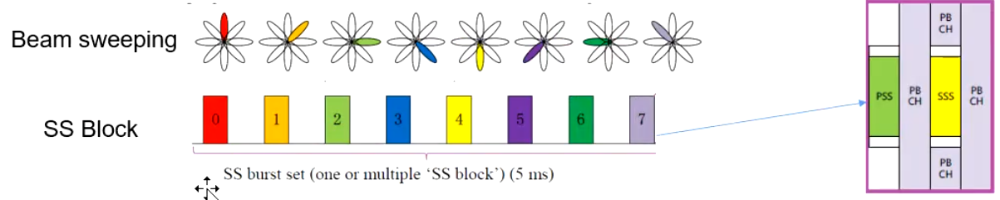
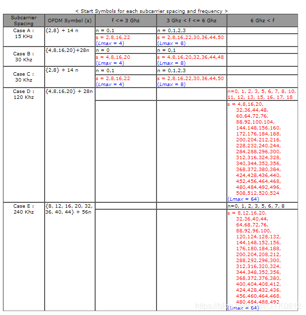

						 在5G中，每个SSB对应一个beam， SSB的最短时间跨度为5 ms(半帧)。如下为示意图：

一个半帧中可能存在多个SSB，我们将一个半帧中存在的一个或多个SSB称为SS Burst Set，一个SS Burst Set中的SSB包含的信息相同。

两个SS Burst Set出现的时间，也就是存在SSB的半帧出现的时间是可以配置的，成为SS Burst Set Periodicity，5 ms–160 ms范围。默认为20 ms。

SSB符号的起始位置取决于Case类型以及所处频段，一个SSB在时域上占据4个符号。L为SSB的最大取值。

symbol 起始位置图：

