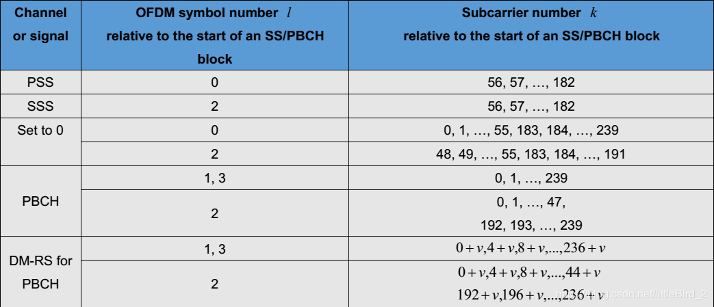

·
# 初始小区搜索过程
  
小区搜索是UE获取与小区的时间和频率同步并检测该小区ID的过程。NR小区搜索基于同步栅格上的PSS、SSS、PBCH-DMRS。

**LTE 和 NR 小区搜索对比:**
```text
LTE 小区搜索流程:
1. UE开机或进入新小区 -> 扫描中心频点寻找PSS
2. 检测到PSS -> 获取时隙同步
3. 基于PSS检测SSS -> 获取帧同步和物理小区ID的一部分
4. 解码PBCH -> 获取MIB
5. MIB中包含系统帧号、小区带宽信息等
6. 读取SIB1和其他SIBs -> 获取小区接入信息
---
NR 小区搜索流程:
1. UE开机或进入新小区 -> 根据同步栅格调整频率
2. 检测到PSS和SSS -> 获取时隙同步和帧同步
3. 解码PBCH -> 获取MIB
4. MIB中包含SS Block周期、子载波间隔等
5. 根据MIB中的PDCCH配置信息 -> 查找CORESET0和搜索空间
6. 盲检DCI 1_0 -> 获取SIB1调度信息
7. 解码PDSCH上的SIB1 -> 获取小区接入信息
8. 继续解码其他SIBs -> 获取完整网络配置
```

NR初始小区搜索过程示意图：


本笔记将重点讲解SSB、PBCH 的过程。
## 前置概念  

在讲SSB 概念之前，我们需要对[全局栅格、信道栅格、同步栅格](初始小区搜索/全局栅格、信道栅格、同步栅格.md)的概念要有一个清晰的认识。

- 全局栅格：定义绝对频点号范围
- 信道栅格：定义实际小区中心频点的映射
- 同步栅格：定义SSB的频域位置
## SSB
### SSB 的结构


### 概述：

1. NR SSB 时域频域分析
2. PSS/SSS序列
3. PBCH payload 生成及处理
4. PBCH加扰/调制/RE映射
5. PBCH DMRS
6. UE SSB处理过程
7. 同步过程理解

**LTE与NR 的比较**
与LTE不同，NR中SSB的时域位置和频域位置都不再固定，而是灵活可变的。
1. 频域上，SSB不再固定于频带中间；
2. 时域上，SSB发送的位置和数量都可能变化。
所以，在NR中，仅通过解调PSS/SSS信号，是无法获得频域和时域资源的完全同步的，必须完成PBCH的解调，才能最终达到时频资源的同步。
### NR SSB 时域频域分析
#### 时域分析

一个半帧中可能存在多个SSB，我们将一个半帧中存在的一个或多个SSB称为SS Burst Set，一个SS Burst Set中的SSB包含的信息相同。

两个SS Burst Set出现的时间，也就是存在SSB的半帧出现的时间是可以配置的，成为SS Burst Set Periodicity，5 ms–160 ms范围。默认为20 ms。

SSB符号的起始位置取决于Case类型以及所处频段，一个SSB在时域上占据4个符号。L为SSB的最大取值。


以Case A，小于等于3 GHz为例，其符号位置如下图所示，SSB总数为4，各个SSB代表了不同的波束方向


**case pattern 设计**  
SSB时域位置设计其实主要是考虑到不同子载波之间的共存。我们将case A B和C以及60kHz子载波间隔的情况下的子帧画在同一个图里：


一个15kHz slot会对应2个30kHz子载波下的slot。
对于case A来说，将SSB放在这些位置，是考虑到其时隙开头的2个符号0和1可以用于下行控制的传输，这两个符号对应30kHz子载波情况下的符号0 1 2 3，同样也可以用于30kHz子载波情况下的下行控制传输。
15kHz下两个SSB之间的预留的符号6和7可用于GP和上行控制的传输，对应30kHz下第一个子帧的符号12和13以及第二个子帧中的符号0和1，这样也可以保证30kHz下第一个子帧中有用于传输GP和上行控制的资源，以及第二个子帧中有用于传输上行控制的资源。
但大家此时就会发现，同样的道理，那Case B此时无法与60kHz的子载波间隔共存，因为case B中SSB0和SSB1占据的资源对应60kHz子载波间隔下第一个子帧的符号8-13以及第二个子帧的符号0-9，并没有为60kHz下预留用于GP或者上下行控制传输的资源。所以这也就是为什么30kHz子载波间隔情况下会有两种不同case。Case C也是30kHz子载波间隔，但case C就可以很好的与60kHz子载波间隔共存，但case C前后预留的资源对应于15kHz子载波间隔下的符号0和符号13，不足以用于传输控制资源，所以case C很难与15kHz子载波间隔共存。所以case B和case C在真正使用的时候要取决于具体的情况。Case D和E也是同样的道理，不再进行分析  

SSB的Case由Band决定，在协议[TS 38.104]中规定：


#### 频域分析


频域是由20个RB，也即240个子载波构成，它包含着set 0 ,PSS,SSS,PBCH,DMRS, 示意图如上所示，结构如下表所示



不同的operating band是分配给不同运营商的，所以UE是知道自己处在哪个operating band上的，比如n28分配给广电的，那么接入广电网络的UE在搜索SSB的时候，就盲检1901 – <<1>> – 2002这个范围内的GSCN()，并且只搜索15kHz子载波间隔、case A下的SSB。


下面介绍$k_{ssb}$
先看下图：


想要看懂这个图，我们先要知道在NR中，同步栅格（也就是上面所说的GSCN）和频率栅格不再对齐。在LTE中，因为只有15kHz一种子载波间隔，并且带宽也不是很大，所以LTE中同步栅格和频率栅格是对齐的，但在NR中，由于频带很广，而且有5种不同的子载波间隔，所以协议重新定义了同步栅格，其不再与频率栅格对齐。
再来看上图，由于同步栅格和频率栅格的不对齐，SSB的第0号RB的第0号子载波与和SSB有重叠的BWP中的RB中的最低RB的第0号子载波之间的频率偏差叫做kssb。这句话听起来可能有些拗口，图中蓝色的部分表示BWP中与SSB有重叠的RB，那么这些RB中的最低的一个，也就是图中箭头指向的那一个RB，它的0号子载波与SSB的频率最低点，也就是SSB的0号RB的0号子载波，之间的频率偏差叫做kssb。有了这个kssb以后，再看下图：
![[Pasted image 20240910090354.png]]

图中的offset2就是上面所说的kssb，offset1是point A和箭头所指蓝色位置RB的子载波0之间的频率偏差。而Point A是什么，point A是公共资源，也就是CRB的0号子载波。有了offset1和offset2，我们就可以知道SSB在频域中的位置了，即：距离CRB的子载波0有offset1+offset2的频率偏移。但在实际中，并不是先知道point A的位置再知道SSB，因为UE最先接收的是SSB，然后再进行时频同步，所以UE是先知道SSB的位置，再根据offset1和offset2来找point A的位置。那到底怎么知道SSB在什么频域位置呢？UE也不知道，所以UE只能在同步栅格上一个一个的找。

总结一下：
1. SSB的中心频率位置服从同步栅格
2. PDCCH/PDSCH 所在载波中心频率的位置服从信道栅格
3. SSB的子载波0与SSB子载波0所在的CRB的子载波0之间的偏移为$k_{ssb}$个子载波
