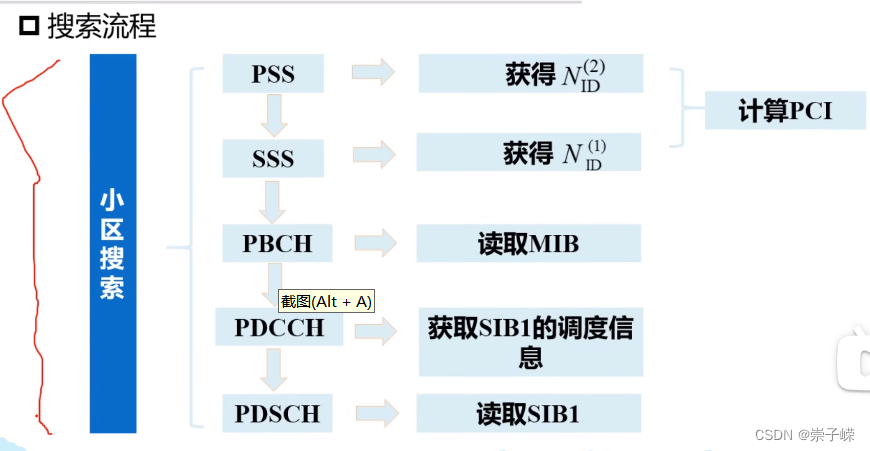
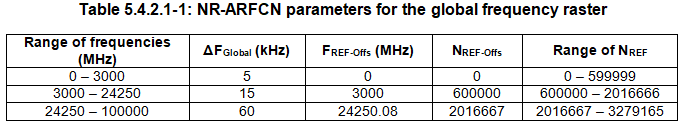

# 初始小区搜索过程

# 概述：

小区搜索是UE获取与小区的时间和频率同步并检测该小区ID的过程。NR小区搜索基于同步栅格上的PSS、SSS、PBCH-DMRS。

初始小区搜索过程大体如下图所示：

本笔记将重点讲解SSB、PBCH 的过程。
## 前置概念

在讲SSB 概念之前，我们需要对全局栅格、信道栅格、同步栅格的概念要有一个清晰的认识。

### 1. **全局栅格**

**定义**  RF参考频率的集合$F_{REF}$

**频域范围:**   0-100GHz

**目的：**  标识RF信道、SSB或者其他资源的频域位置。

**NR-ARFCN（NR Absolute Radio Frequency Channel Number):** 为了对RF参考频率的频域范围进行编码，取值范围为 [0，1，…，3279165]

NR-ARFCN和RF参考频率的关系如下式所示
$$ F_{REF}  = F_{REF-OFFs} + \Delta F_{Global}(N_{REF}-N_{REF-Offs})$$

	

	

### 2. **信道栅格**
信道栅格定义为RF参考频率的子集，主要用来标识在上下行链路中RF信道的频域位置。在每一个工作带宽中，来自全局频率栅格的不同频率子集用于适配不同的工作频段，从而形成以$\Delta F_{Raster}$
​
 为粒度的信道栅格，此信道栅格的频率范围有可能等于或者大于全局信道栅格的粒度$\Delta F_{Global}$
       在FR1和FR2频段范围内，各个工作频段与信道栅格的映射关系如下表所示
### 3. 同步栅格

# SSB
与LTE不同，NR中SSB的时域位置和频域位置都不再固定，而是灵活可变的。频域上，SSB不再固定于频带中间；时域上，SSB发送的位置和数量都可能变化。所以，在NR中，仅通过解调PSS/SSS信号，是无法获得频域和时域资源的完全同步的，必须完成PBCH的解调，才能最终达到时频资源的同步。

